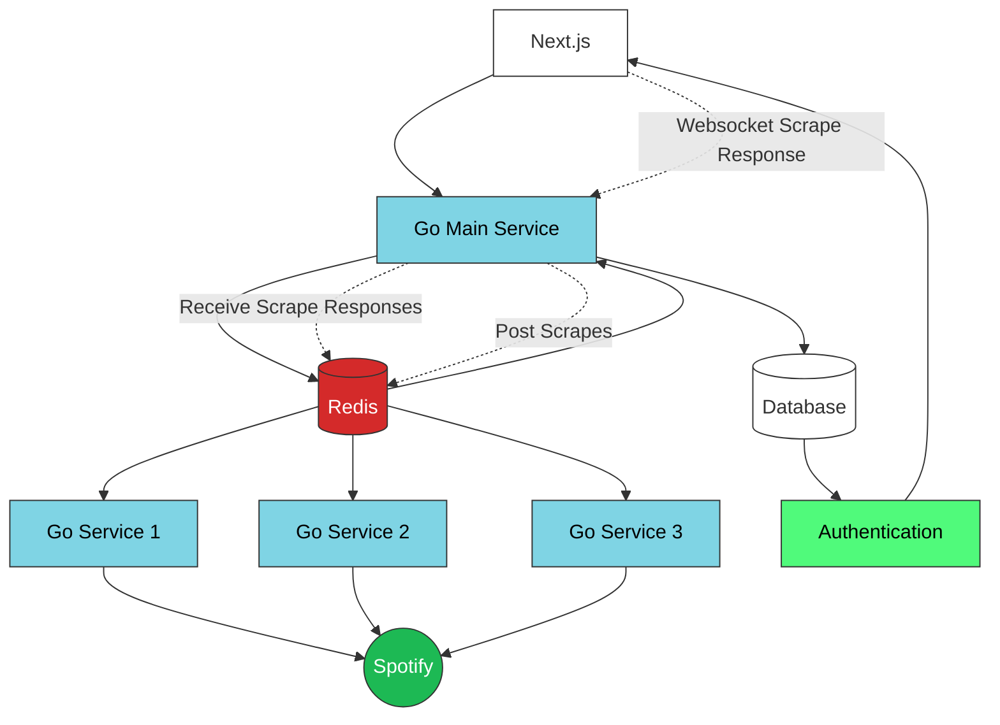
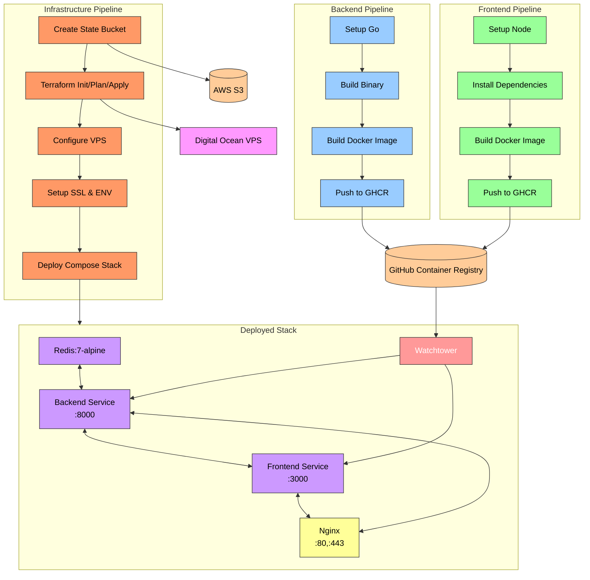

# shrillecho playlist archive

- Architected distributed web crawling system using Go microservices and Redis queues, enabling parallel Spotify API processing
- Implemented real-time updates using WebSocket protocol and event-driven architecture for live crawl status
- Designed CI/CD pipeline using GitHub Actions, Docker, and Terraform for automated deployment to Digital Ocean
- Built responsive Next.js frontend with Supabase authentication and PostgreSQL database integration

### System

- The App is comprised of various components
  - **Frontend** - Next.JS 
  - **Database** - Supabase (PostgreSQL)
  - **Auth** - Supabase
  - **Caching / Queues** - Redis
  - **Backend** - Go
- The core component is the ability to scrape spotify using a distributed architecture of worker nodes that communicate via Redis.
  1. The user inputs a *seed* and a specified *depth* and then the API will crawl the spotify API from that point and retrieve data similar to the seed. For example this would be some *artist* and *depth* and it uses the related artists API to collect a pool of artists.
  2. To enable this scrape we simply utilise a queueing system via Redis, where the user submits a request to `/api/scrape` and this pushes a scrape task to the backend workers.
  3. The workers which are little Golang image can be deployed in various places and can read this global queue to process the scrape and then return the response to the user.
  4. The main backend app will be listening to the workers response and will write the results to Supabase & submit a Websocket response to the frontend to signal the operation was complete.

### Devops

- Hosting: VPS
- Infrastructure: Terraform
- Terraform state: AWS S3
- Pipeline: Github Actions

1. `backend` builds and deploys an image to the Github registry
2. `frontend` builds and deploys an image to the Github registry
3. `infra` setups digital ocean VPS using terraform. It will SSH into this and setup Docker, SSH, clone the repo and start docker compose. It will use watchtower to poll for `frontend` and `backend` images as they are released.

