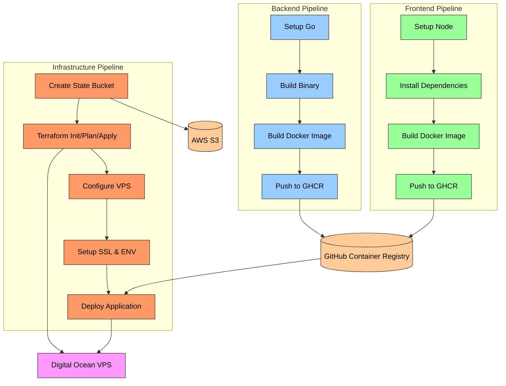

# Devops

- Hosting: VPS
- Infrastructure: Terraform
- Terraform state: AWS S3
- Pipeline: Github Actions

1. `backend` builds and deploys an image to the Github registry
2. `frontend` builds and deploys an image to the Github registry
3. `infra` setups digital ocean VPS using terraform. It will SSH into this and setup Docker, SSH, clone the repo and start docker compose. It will use watchtower to poll for `frontend` and `backend` images as they are released.

