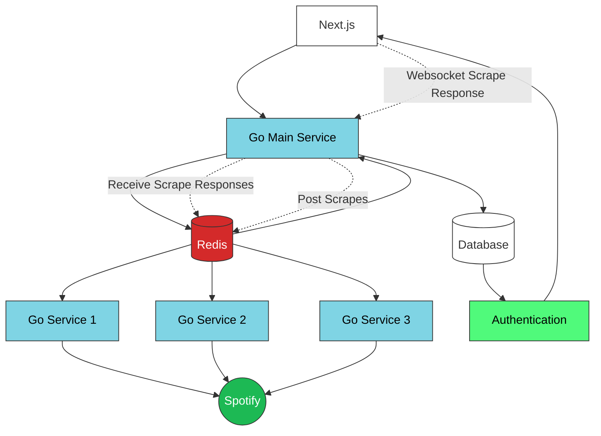

# System

- The App is comprised of various components
  - **Frontend** - Next.JS 
  - **Database** - Supabase (PostgreSQL)
  - **Auth** - Supabase
  - **Caching / Queues** - Redis
  - **Backend** - Go
- The core component is the ability to scrape spotify using a distributed architecture of worker nodes that communicate via Redis.
  1. The user inputs a *seed* and a specified *depth* and then the API will crawl the spotify API from that point and retrieve data similar to the seed. For example this would be some *artist* and *depth* and it uses the related artists API to collect a pool of artists.
  2. To enable this scrape we simply utilise a queueing system via Redis, where the user submits a request to `/api/scrape` and this pushes a scrape task to the backend workers.
  3. The workers which are little Golang image can be deployed in various places and can read this global queue to process the scrape and then return the response to the user.
  4. The main backend app will be listening to the workers response and will write the results to Supabase & submit a Websocket response to the frontend to signal the operation was complete.

